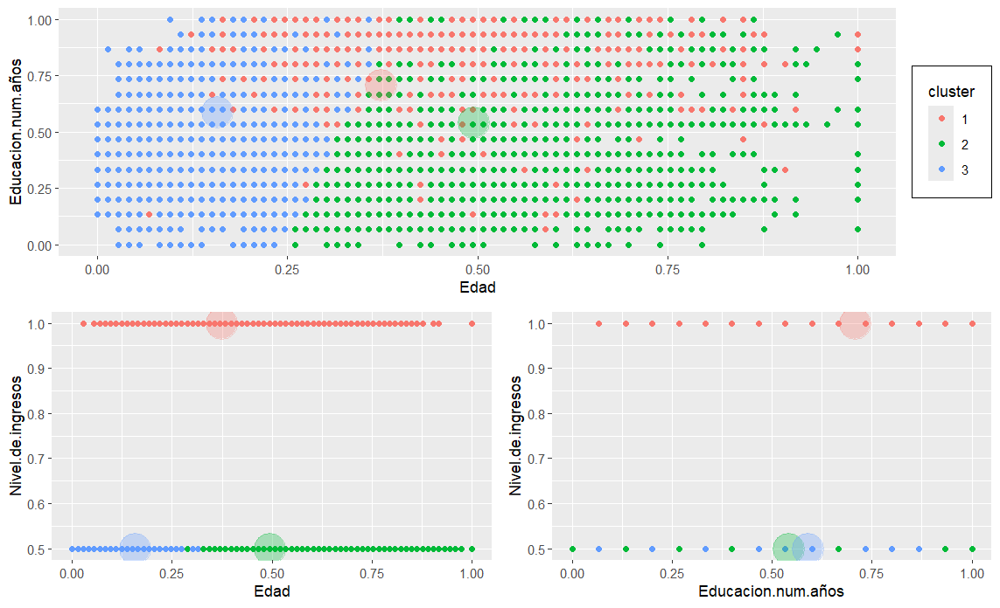

# Prácticas de la asignatura "Ciencia de Datos"

## Máster en Software de Sistemas Distribuidos y Empotrados, Universidad Politécnica de Madrid

### Ejercicio 1: Objetos en R y Análisis Estadístico Básico.

### Ejercicio 2: Segmentación de Datos - Clustering

### Ejercicio 3: Series Temporales - ARIMA

### Ejercicio Final
#### Clustering: 
Tenemos los datos de vinos de España de distintas denominaciones de origen, se requiere hacer una segmentación de vinos españoles en función de precio, calidad y acidez del vino.
#### Series Temporales:
Tenemos los datos del precio de venta del excedente de sistemas fotovoltaicos a la 
red eléctrica nacional, para distintos periodos de tiempo y con distinta resolución 
temporal. Se pide ajustar un modelo a la serie y predecir futuros valores.

